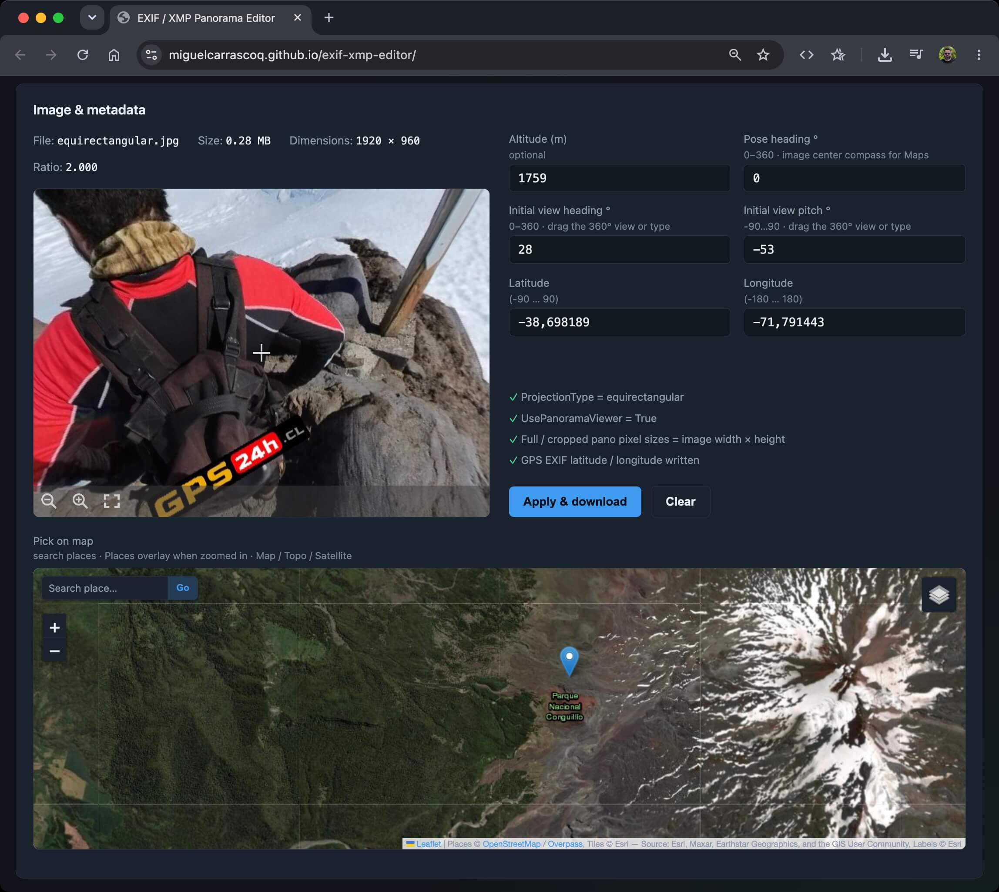

# EXIF / XMP Panorama Editor

Browser-based tool to add **GPS coordinates** and **Google Photo Sphere (GPano) XMP** metadata to equirectangular JPEG panoramas. Processing runs entirely on your device — nothing is uploaded to a server.

**[Live demo](https://miguelcarrascoq.github.io/exif-xmp-editor/)**



## Why

Google Maps and related products recognize a JPEG as a photo sphere when it contains the [GPano XMP namespace](https://developers.google.com/streetview/spherical-metadata) (`http://ns.google.com/photos/1.0/panorama/`). Latitude/longitude are stored as standard EXIF GPS tags.

Typical input: a full equirectangular stitch (for example `5888 × 2944`, aspect ratio ≈ 2:1).

## Features

- Drag & drop or select a JPEG (or try the built-in sample panorama if you have none)
- Read existing GPS and GPano values when present
- Edit latitude, longitude, optional altitude
- Pick GPS on a map (OSM / OpenTopoMap / Esri satellite, Nominatim place search, OSM Places via Overpass when zoomed in)
- Set `PoseHeadingDegrees` (required for display on Google Maps)
- Optional pose pitch / roll
- Auto-fill full-sphere crop/size tags from image dimensions
- Download a new JPEG with embedded EXIF GPS + XMP GPano

## Metadata written

| Tag | Value |
|-----|--------|
| `GPano:ProjectionType` | `equirectangular` |
| `GPano:UsePanoramaViewer` | `True` |
| `GPano:PoseHeadingDegrees` | from form (0 – &lt; 360) |
| `GPano:CroppedArea*Pixels` | `0` / image size |
| `GPano:FullPano*Pixels` | image width × height |
| `GPano:StitchingSoftware` | `exif-xmp-editor` |
| EXIF GPS | latitude, longitude, optional altitude |

This app **does not** publish to Google Maps or Street View. It only prepares the file so those services can treat it as a panorama when you upload it.

## Stack

- [Vite](https://vitejs.dev/) + TypeScript
- [exifr](https://github.com/MikeKovarik/exifr) for reading EXIF/GPS
- [Leaflet](https://leafletjs.com/) map picker with [OpenStreetMap](https://www.openstreetmap.org/copyright), [OpenTopoMap](https://opentopomap.org/), and [Esri World Imagery](https://www.esri.com/) tiles; place search via [Nominatim](https://nominatim.openstreetmap.org/); nearby named places (peaks, volcanoes, tourism, …) via [Overpass](https://overpass-api.de/) when zoomed in (tiles/POI queries load in the browser; the JPEG itself is never uploaded)
- Custom JPEG APP1 writers for GPS EXIF and GPano XMP
- Deployable to **GitHub Pages** (or any static host / VPS nginx)

## Development

Requirements: Node.js 18+ (20+ recommended).

```bash
npm install
npm run dev
```

A sample equirectangular JPEG (`1920 × 960`) is served from `public/samples/equirectangular.jpg` and can be loaded from the dropzone (“Try sample panorama”).

Build for production:

```bash
npm run build
npm run preview
```

For GitHub Pages the Vite `base` is set to `/exif-xmp-editor/`.

## Deploy (GitHub Pages)

1. Push this repository to `https://github.com/miguelcarrascoq/exif-xmp-editor`
2. Repo **Settings → Pages → Build and deployment → Source: GitHub Actions**
3. Push to `main`; the workflow builds and publishes `dist/`

## Verify with ExifTool (optional)

```bash
exiftool -G1 -a -s -GPS:all -XMP-GPano:all your-output.jpg
```

Equivalent CLI for a full sphere (reference only; this project does not require ExifTool at runtime):

```bash
exiftool \
  -XMP-GPano:UsePanoramaViewer=True \
  -XMP-GPano:ProjectionType=equirectangular \
  -XMP-GPano:PoseHeadingDegrees=0 \
  -XMP-GPano:CroppedAreaLeftPixels=0 \
  -XMP-GPano:CroppedAreaTopPixels=0 \
  -XMP-GPano:CroppedAreaImageWidthPixels=5888 \
  -XMP-GPano:CroppedAreaImageHeightPixels=2944 \
  -XMP-GPano:FullPanoWidthPixels=5888 \
  -XMP-GPano:FullPanoHeightPixels=2944 \
  -GPSLatitude= -GPSLongitude= panorama.jpg
```

## Scope / limitations

- JPEG only (no HEIC, RAW, or TIFF in v1)
- One image per session
- Writing GPS replaces the existing EXIF APP1 segment with a compact GPS-focused EXIF (other EXIF camera tags may be dropped)
- Very large XMP packets are constrained by the JPEG APP1 size limit (~64 KiB); the packet generated here stays well under that limit

## License

MIT
